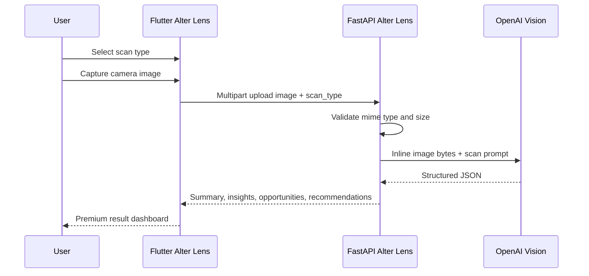

# ALTER Lens



## Scan Types

- Resume
- Startup deck
- Event poster
- Research paper
- Product

## Flutter Runtime

Run the app with the backend URL:

```powershell
flutter run --dart-define=ALTER_LENS_URL=http://localhost:8130
```

For Android emulator, use `http://10.0.2.2:8130`. For physical devices, use
the machine LAN IP.

## Native Camera Setup

This repo currently has Flutter source only. After generating platform folders,
add camera permissions.

Android `android/app/src/main/AndroidManifest.xml`:

```xml
<uses-permission android:name="android.permission.CAMERA" />
```

iOS `ios/Runner/Info.plist`:

```xml
<key>NSCameraUsageDescription</key>
<string>ALTER uses the camera to analyze resumes, decks, posters, papers, and products.</string>
```

## Backend Runtime

```powershell
cd services\alter_lens
python -m venv .venv
.\.venv\Scripts\python.exe -m pip install -e ".[dev]"
.\.venv\Scripts\python.exe -m uvicorn alter_lens.api:app --reload --port 8130
```

Production OpenAI mode:

```powershell
$env:ALTER_LENS_ENV="production"
$env:OPENAI_API_KEY="..."
$env:ALTER_LENS_OPENAI_MODEL="gpt-4.1-mini"
```
