# ALTER Unicorn Launch Blueprint

ALTER is a voice-first AI Future Operating System that helps people explore
future possibilities before important life decisions. It combines personal
memory, social context, opportunity discovery, camera intelligence, NFC
networking, and multi-agent reasoning into one command layer.

## 1. Product Requirements Document

### Vision

ALTER becomes the trusted operating layer for high-agency decisions: career,
startup, education, relocation, networking, hiring, and reputation. The product
does not merely answer questions. It simulates futures, debates tradeoffs,
remembers user context, finds opportunities, and turns ambient signals into
actions.

### Target Users

- Students deciding between internships, research, startup ideas, and graduate
  programs.
- Early career builders choosing skills, roles, mentors, and communities.
- Founders deciding markets, co-founders, investors, grants, and GTM paths.
- Operators and creators managing reputation, meetings, documents, and follow-up.

### Core Jobs

- "Before I choose, show me what each future could become."
- "Remember who I am and use that context every time."
- "Find opportunities I would miss."
- "Debate the decision from multiple versions of me."
- "Turn real world context from voice, camera, and NFC into useful memory."

### MVP Promise

In less than five minutes, a user can ask a life or career question, receive
three future timelines, hear a Clone Council debate, discover relevant
opportunities, and save the decision into lifelong memory.

### Success Metrics

| Metric | MVP Target | Why It Matters |
| --- | --- | --- |
| Week 1 activation | 55 percent | Users reach first meaningful simulation |
| Day 7 retention | 28 percent | Decisions and memory create repeat value |
| Simulations per active user | 4 per week | Core future exploration habit |
| Saved memories per active user | 12 per week | Memory graph depth compounds |
| Opportunity click-through | 18 percent | Discovery quality |
| NFC exchange to follow-up | 35 percent | Offline-to-online network value |

### Non-Goals For MVP

- Full autonomous life planning without user confirmation.
- Public social network feed.
- Financial, medical, or legal advice as definitive guidance.
- Consumer cloud file indexing before explicit permission and data controls.

## 2. System Architecture

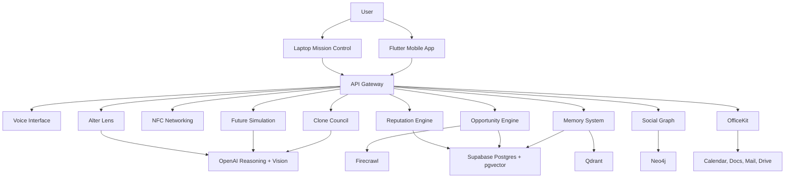

### Principles

- Mobile-first capture. Laptop-first synthesis.
- Personal data is permissioned, scoped, auditable, and revocable.
- Reasoning services are stateless where possible; memory services own durable
  context.
- Every model output returns structured JSON plus provenance.
- Every important user decision becomes a memory node.

## 3. Database Schema

### PostgreSQL Core

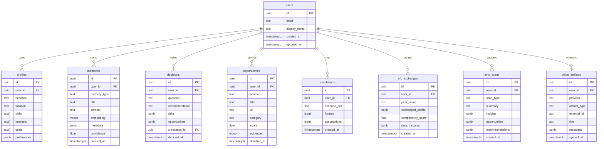

### Neo4j Graph

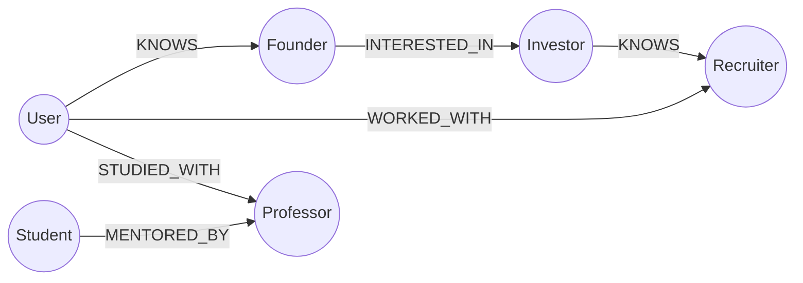

### Vector Stores

- `pgvector`: authoritative memory embeddings, transactional with Supabase.
- `Qdrant`: fast semantic retrieval cache for large corpora, crawled
  opportunities, and document chunks.

## 4. API Design

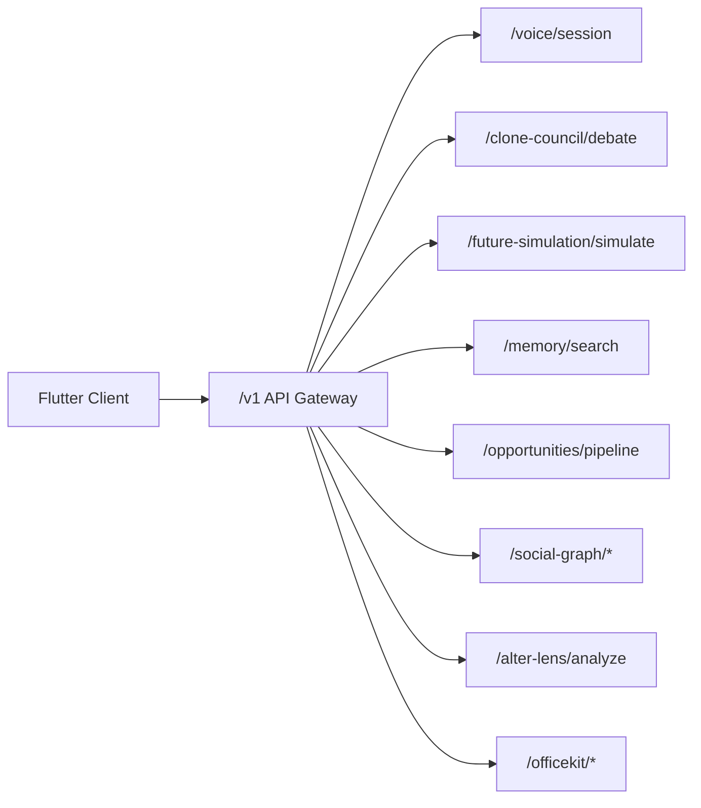

### Public Client API

| Method | Path | Purpose |
| --- | --- | --- |
| `POST` | `/v1/voice/session` | Start a voice-first reasoning session |
| `POST` | `/v1/future-simulation/simulate` | Generate Future A, B, and C |
| `POST` | `/v1/clone-council/debate` | Run multi-agent debate |
| `POST` | `/v1/memory/items` | Store long-term memory |
| `POST` | `/v1/memory/search` | Semantic memory search |
| `POST` | `/v1/opportunities/pipeline` | Crawl, rank, recommend |
| `POST` | `/v1/social-graph/mutual-connections` | Find mutual paths |
| `POST` | `/v1/social-graph/team-formation` | Build candidate team |
| `POST` | `/v1/alter-lens/analyze` | Analyze camera image |
| `POST` | `/v1/nfc/exchanges` | Store NFC exchange |
| `POST` | `/v1/officekit/briefing` | Generate mission briefing |

### API Rules

- All writes include `idempotency_key`.
- All AI responses include `model`, `prompt_version`, and `provenance`.
- All user-facing recommendations include risks and uncertainty.
- PII payloads never enter logs unredacted.

## 5. Mobile App Architecture

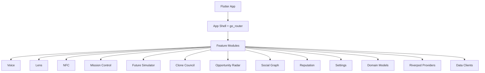

### Frontend Layers

| Layer | Responsibility |
| --- | --- |
| `app` | Router, shell, theme, global app state |
| `core` | Design tokens, responsive helpers, reusable controls |
| `domain` | Pure models and repository contracts |
| `data` | API clients and local adapters |
| `application` | Riverpod state controllers |
| `presentation` | Screens, widgets, animations |

### Device Split

- Phone: voice capture, camera intelligence, NFC exchange.
- Laptop: mission control, timelines, council debates, opportunity radar,
  social graph, reputation dashboard.

## 6. Backend Architecture

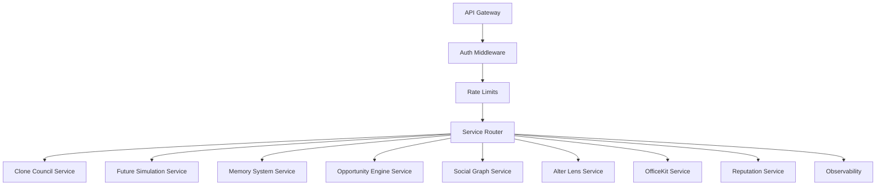

### Services In This Repo

- `services/clone_council`
- `services/future_simulation`
- `services/memory_system`
- `services/opportunity_engine`
- `services/social_graph`
- `services/alter_lens`
- `services/api_gateway`
- `services/voice_gateway`
- `services/reputation_engine`
- `services/officekit`

### Services To Add Next

- `services/notification_orchestrator`

## 7. Agent Architecture

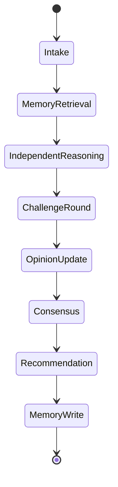

### Clone Council Agents

| Agent | Role |
| --- | --- |
| Current You | Grounded current context and constraints |
| Future You | Long-term path and regret minimization |
| Founder You | Product, risk, speed, and leverage |
| Investor You | Market, odds, asymmetric upside |
| Mentor You | Learning, values, human judgment |
| Recruiter You | Career signal, marketability, network |
| Realist You | Tradeoffs, failure modes, operational constraints |

### Agent Contract

```json
{
  "agent": "Founder You",
  "stance": "Proceed with a narrow pilot",
  "reasoning": ["Market signal is specific", "Distribution is warm"],
  "challenges": ["Risk: onboarding trust gap"],
  "updated_opinion": "Proceed after permission design",
  "confidence": 0.82
}
```

## 8. Memory System

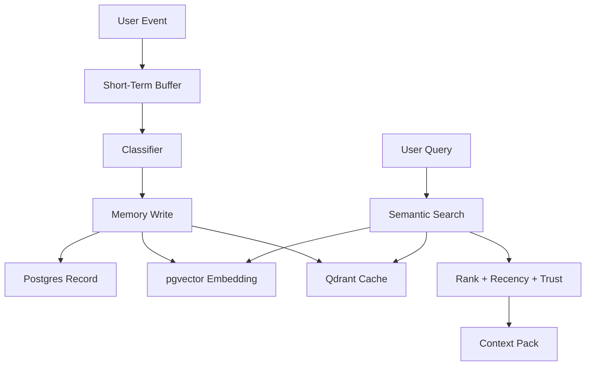

### Stored Memory Types

- Skills
- Projects
- Goals
- Conversations
- Opportunities
- Decisions
- Mentors
- Friends
- Learning progress
- Lens scans
- NFC exchanges
- Office artifacts

### Memory Update Rules

- Merge duplicate facts with confidence scoring.
- Preserve conflicting memories with timestamps.
- Promote short-term memories after repeated relevance.
- Allow user delete, export, and correction.
- Never silently infer sensitive attributes.

## 9. Opportunity Engine

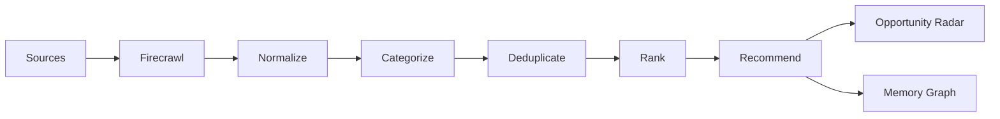

### Sources

- LinkedIn
- Internshala
- Unstop
- Devpost
- YC
- GSoC
- Google programs
- Research fellowships
- Startup grants

### Ranking Formula

```text
score =
  profile_fit * 0.30 +
  goal_fit * 0.22 +
  deadline_urgency * 0.12 +
  network_path * 0.14 +
  reputation_upside * 0.10 +
  rarity * 0.08 +
  confidence * 0.04
```

## 10. Social Graph

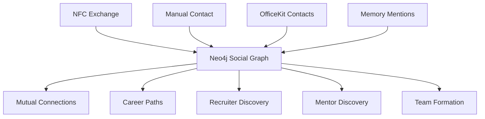

### Graph Queries

- Mutual connections within depth 2.
- Warm path from user to target role.
- Recruiters matching skills, location, and goals.
- Mentors matching interests and career arc.
- Team candidates with complementary skills and trust paths.

## 11. NFC Layer

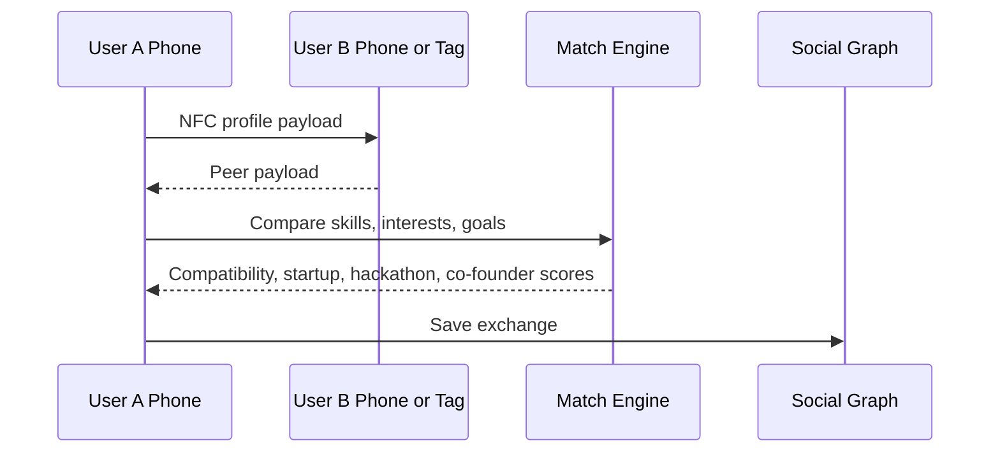

### NFC Payload

- Portfolio
- Resume
- LinkedIn
- Skills
- Interests
- Goals
- Collaboration intent

### Match Scores

- Compatibility Score
- Startup Match
- Hackathon Match
- Co-founder Match

## 12. Camera Intelligence

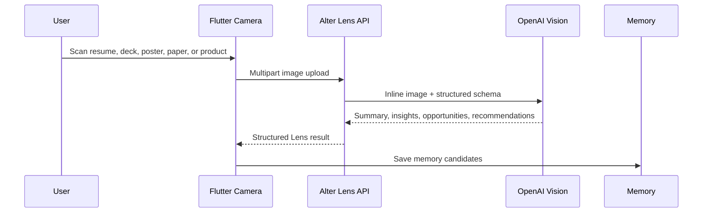

### Outputs

- Summary
- Insights
- Opportunities
- Recommendations
- Extracted entities
- Memory candidates

## 13. OfficeKit Integration

OfficeKit turns daily work artifacts into mission context.

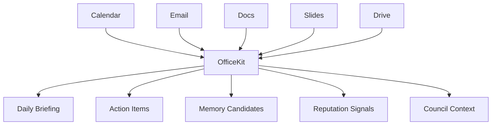

### MVP Integrations

- Calendar read-only availability and meeting context.
- Document upload or selected Drive files.
- Email thread import by explicit user action.
- Meeting brief generator.
- Follow-up generator.
- Action item extraction.

### OfficeKit Data Contract

```json
{
  "artifact_type": "meeting",
  "title": "Investor demo prep",
  "participants": ["founder", "mentor"],
  "summary": "Prepare concise beta story",
  "actions": ["Send deck", "Draft follow-up"],
  "memory_candidates": ["investor_feedback", "demo_story"]
}
```

## 14. Deployment Architecture

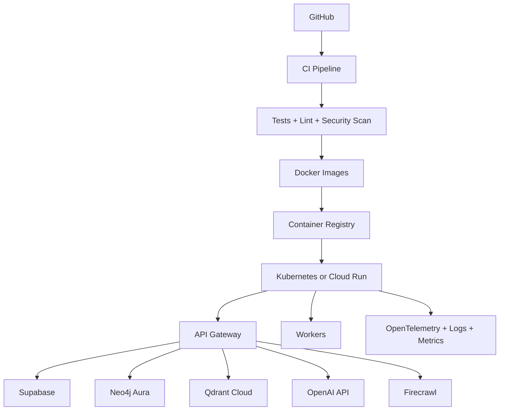

### Environments

| Environment | Purpose |
| --- | --- |
| Local | deterministic adapters, no paid AI calls by default |
| Preview | per-PR service deploys, seeded demo data |
| Staging | production-like data contracts and auth |
| Production | isolated secrets, full monitoring, backups |

## 15. Security Architecture

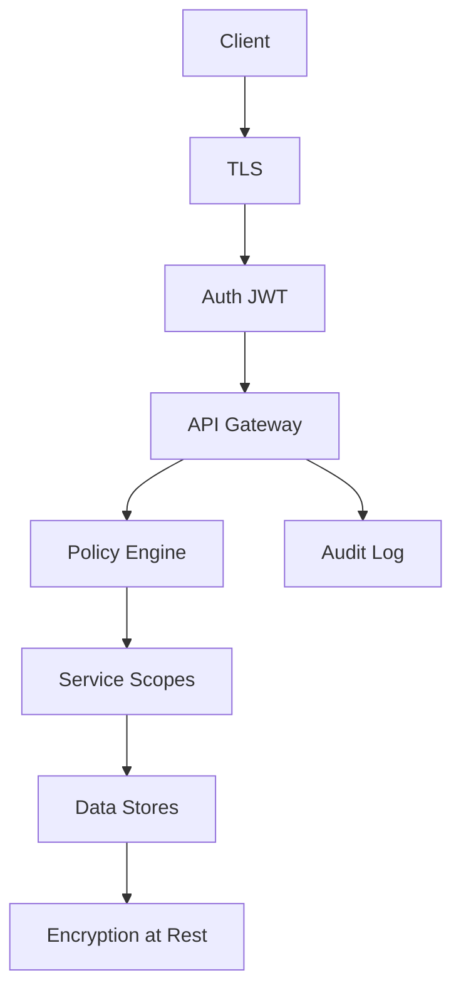

### Security Controls

- Supabase Auth with JWT validation at gateway.
- Row-level security by `user_id`.
- Service-to-service tokens with least privilege.
- KMS-managed secrets.
- PII redaction in logs.
- User data export and deletion.
- Consent gates for camera, NFC, OfficeKit, memory, and graph.
- Prompt injection defenses for crawled and OfficeKit content.
- Model output policy checks before user display.

### Threat Model

| Threat | Mitigation |
| --- | --- |
| Prompt injection from crawled pages | Strip scripts, isolate source text, add tool boundaries |
| Over-remembering sensitive data | Consent UI, memory review, delete controls |
| NFC spoofing | Signed profile payloads, freshness timestamps |
| Office data leakage | OAuth scopes, artifact allowlist, audit trail |
| Model hallucination | Structured schemas, provenance, confidence, uncertainty |

## 16. Development Roadmap

### Phase 0: Foundation

- Flutter shell and core screens.
- FastAPI service skeletons.
- Memory schema and vector search.
- Clone Council and Future Simulation.

### Phase 1: MVP

- Voice input to Future Simulation.
- Clone Council debate output.
- Opportunity Radar.
- Memory graph write/search.
- Alter Lens scan flow.
- NFC networking preview and exchange storage.

### Phase 2: Network Effects

- Neo4j-powered warm paths.
- Mentor, recruiter, and team formation workflows.
- Reputation ledger.
- Event mode and conference NFC.

### Phase 3: Work OS

- OfficeKit meeting briefings.
- Email follow-up workflows.
- Mission Control laptop dashboard.
- Team workspaces.

### Phase 4: Platform

- Agent marketplace.
- Opportunity partner APIs.
- Enterprise privacy controls.
- University and accelerator partnerships.

## 17. Sprint Plan

### Sprint 1: Decision Loop

- Build voice prompt to future simulation flow.
- Save simulation to memory.
- Render Future A, B, C with risks and opportunities.
- Add telemetry for activation.

### Sprint 2: Clone Council

- Wire mobile Clone Council to backend.
- Add debate transcript, consensus, confidence, risks.
- Add memory retrieval context.
- Add output quality evaluation tests.

### Sprint 3: Opportunity Radar

- Run Firecrawl pipelines for target sources.
- Normalize and rank opportunities.
- Add deadline and fit filters.
- Save accepted opportunities to memory.

### Sprint 4: Capture Layer

- Ship Alter Lens camera analysis.
- Ship NFC profile exchange.
- Store lens scans and NFC exchanges.
- Add privacy review UI.

### Sprint 5: Social And Reputation

- Connect Neo4j Social Graph APIs.
- Launch mentor and recruiter discovery.
- Add reputation events and follow-up reminders.
- Add trust delta dashboard.

### Sprint 6: OfficeKit And Mission Control

- Calendar and document import.
- Daily mission briefing.
- Laptop Mission Control.
- Cross-device command feed.

## 18. Folder Structure

```text
alter/
  lib/
    main.dart
    src/
      app/
      core/
      data/
      domain/
      features/
        voice/
        lens/
        nfc/
        mission/
        council/
        simulator/
        opportunity/
        social/
        reputation/
        settings/
  services/
    api_gateway/
    voice_gateway/
    clone_council/
    future_simulation/
    memory_system/
    opportunity_engine/
    social_graph/
    alter_lens/
    reputation_engine/
    officekit/
  infra/
    docker/
    terraform/
    k8s/
  docs/
  test/
```

## 19. Wireframes

### Mobile Home And Voice

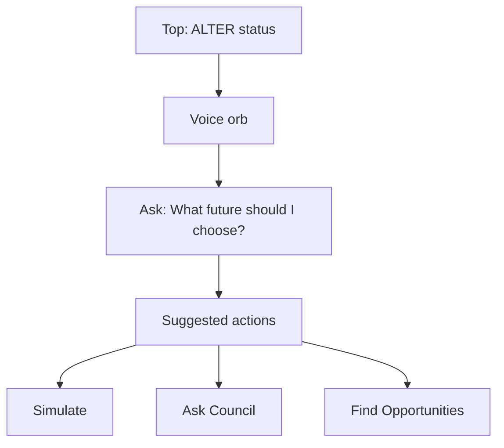

```text
+--------------------------------+
| ALTER                      91% |
| What decision are we testing?  |
|                                |
|          [ voice orb ]         |
|                                |
|  Simulate Future               |
|  Ask Clone Council             |
|  Scan with Lens                |
|  Find Opportunities            |
+--------------------------------+
```

### Laptop Mission Control

```text
+----------------------------------------------------------------+
| Mission Control                         Operator: Aria Shah    |
| Objective: Package demo and route best intros                   |
|                                                                |
| Phone Field Layer       ALTER Command Map       Laptop Layer    |
| Voice  94%              [central graph]         Future 91%      |
| Camera 87%                                    Council 88%       |
| NFC    82%                                    Radar 93%         |
|                                               Social 84%        |
|                                               Reputation 79%    |
|                                                                |
| Future Timeline                      Command Feed              |
+----------------------------------------------------------------+
```

### Future Simulator

```text
+--------------------------------+
| Future Simulator               |
| Input: goals, skills, profile  |
|                                |
| Future A: Founder path         |
| Future B: Research path        |
| Future C: Operator path        |
|                                |
| Salary | Skills | Network      |
| Risk | Opportunity | Success   |
+--------------------------------+
```

### Alter Lens

```text
+--------------------------------+
| Alter Lens                     |
| [Resume][Deck][Poster][Paper]  |
|                                |
|        camera preview          |
|        capture button          |
|                                |
| Summary                        |
| Insights                       |
| Opportunities                  |
| Recommendations                |
+--------------------------------+
```

## 20. Production Ready Code Skeleton

### FastAPI Service Pattern

```python
from fastapi import FastAPI, Depends
from pydantic import BaseModel

app = FastAPI(title="ALTER Service", version="1.0.0")

class Request(BaseModel):
    user_id: str
    payload: dict

class Response(BaseModel):
    result: dict
    confidence: float

def get_service():
    return Service()

@app.post("/v1/service/action", response_model=Response)
async def action(request: Request, service = Depends(get_service)):
    return service.execute(request)
```

### Service Layer Pattern

```python
class Service:
    def __init__(self, repository, model_client, policy):
        self.repository = repository
        self.model_client = model_client
        self.policy = policy

    def execute(self, request):
        context = self.repository.load_context(request.user_id)
        self.policy.authorize(request, context)
        result = self.model_client.generate(request.payload, context)
        self.repository.write_audit(request.user_id, result)
        return result
```

### Flutter Feature Pattern

```dart
final featureControllerProvider =
    NotifierProvider<FeatureController, FeatureState>(
  FeatureController.new,
);

class FeatureController extends Notifier<FeatureState> {
  @override
  FeatureState build() => const FeatureState();

  Future<void> run() async {
    state = state.copyWith(isLoading: true);
    final result = await ref.read(featureApiProvider).execute();
    state = state.copyWith(isLoading: false, result: result);
  }
}
```

### Repository Pattern

```python
from typing import Protocol

class MemoryRepository(Protocol):
    def write(self, item): ...
    def search(self, query): ...

class PostgresMemoryRepository:
    def write(self, item):
        pass

    def search(self, query):
        pass
```

### Event Contract

```json
{
  "event_id": "uuid",
  "user_id": "uuid",
  "event_type": "decision.created",
  "source": "future_simulation",
  "payload": {},
  "created_at": "2026-06-11T00:00:00Z"
}
```

### Production Gates

- Unit tests for service logic.
- API contract tests for every endpoint.
- Golden tests for mission-critical Flutter screens.
- Load tests for retrieval and simulation flows.
- Prompt regression tests for agent outputs.
- Security review before OfficeKit and memory sync.
- Observability dashboards before public launch.
