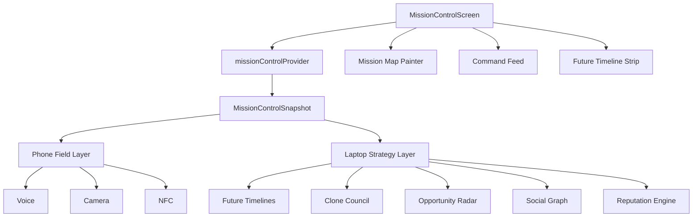
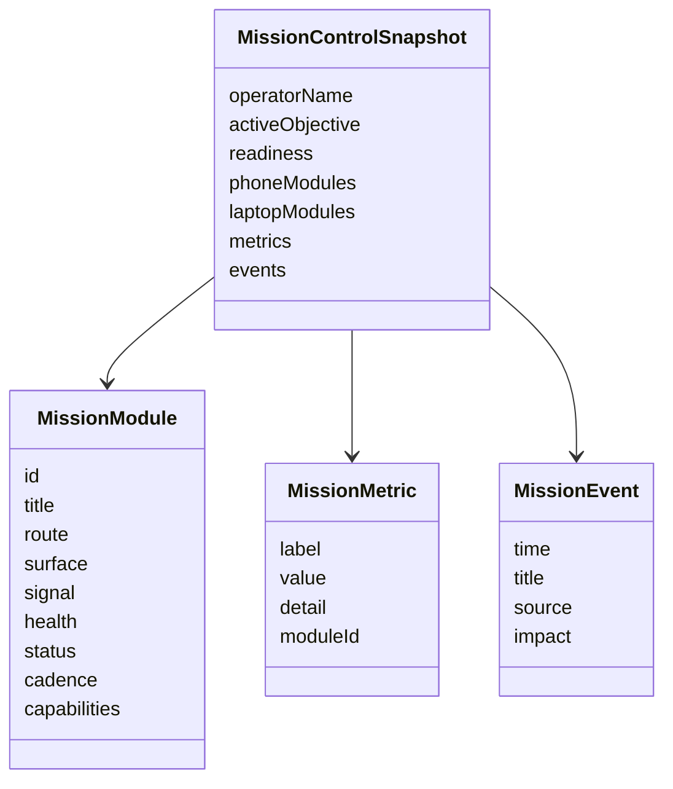
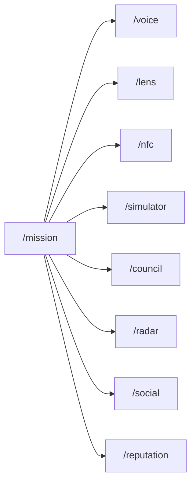

# ALTER Mission Control Frontend Architecture

## Screen Model

## Navigation

## Layout Strategy

- Compact: mission map first, then phone layer, laptop layer, timeline, feed.
- Expanded: phone layer, central mission map, laptop layer in one command row.
- Reusable data model: `MissionControlSnapshot` can be replaced by live backend telemetry.
- Visual language: glass panels, dense telemetry, constrained command map, Linear-style rows.
