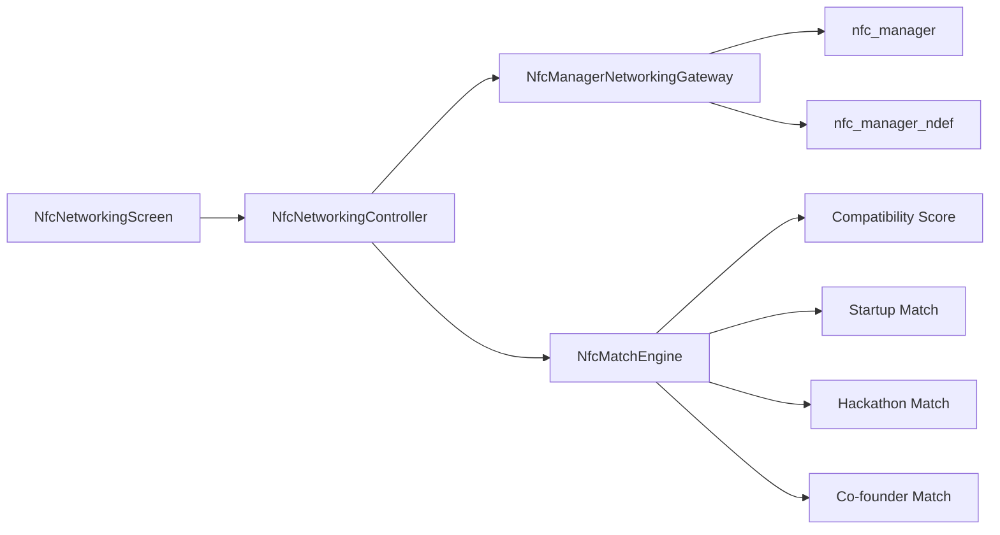

# ALTER NFC Networking

ALTER exchanges a compact NDEF MIME payload containing:

- Portfolio URL
- Resume URL
- LinkedIn URL
- Skills
- Interests
- Goals and collaboration intent

The Flutter feature lives under `lib/src/features/nfc`:



## Native Setup

This repo currently contains Flutter source only. After generating platform folders,
add the native NFC configuration required by `nfc_manager`.

Android `android/app/src/main/AndroidManifest.xml`:

```xml
<uses-permission android:name="android.permission.NFC" />
<uses-feature android:name="android.hardware.nfc" android:required="false" />
```

iOS `ios/Runner/Info.plist`:

```xml
<key>NFCReaderUsageDescription</key>
<string>ALTER uses NFC to exchange networking profiles.</string>
```

iOS entitlements:

```xml
<key>com.apple.developer.nfc.readersession.formats</key>
<array>
  <string>NDEF</string>
</array>
```

## Platform Note

Direct arbitrary phone-to-phone NDEF exchange is platform-constrained, especially on
iOS and modern Android. The implemented Flutter flow supports ALTER profile scanning
and writing through NDEF-compatible NFC tags or a native Android card-emulation relay.
The profile payload and scoring engine are ready for that relay without UI changes.
