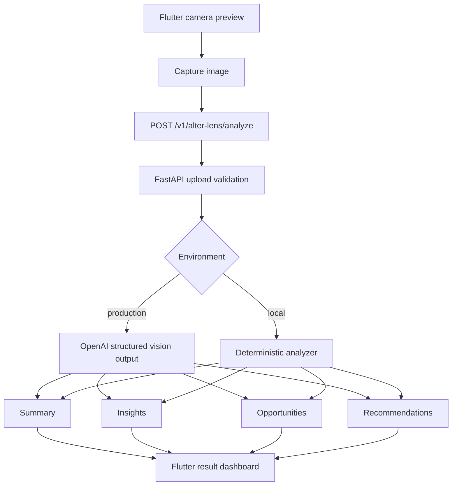
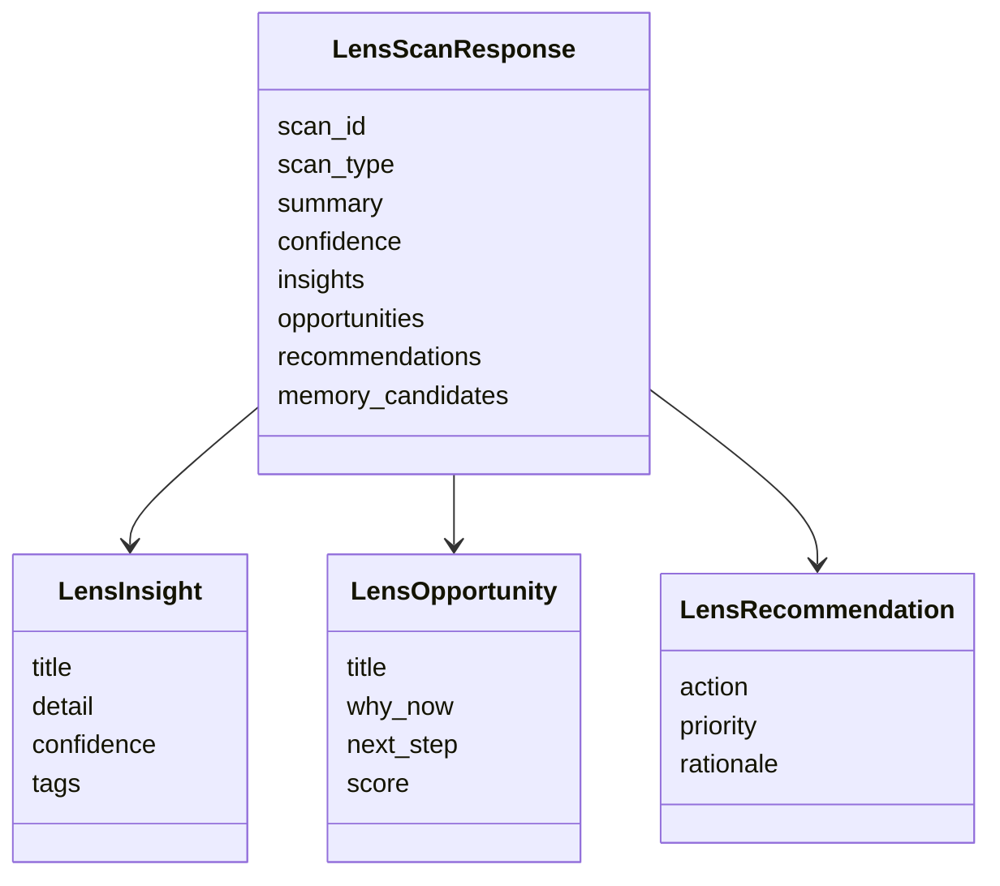

# ALTER Lens

ALTER Lens turns phone camera captures into structured career and opportunity
intelligence with OpenAI vision models.

## Flow



## Scan Types

- Resume
- Startup deck
- Event poster
- Research paper
- Product

## API

| Method | Path | Purpose |
| --- | --- | --- |
| `GET` | `/healthz` | Service health |
| `GET` | `/v1/alter-lens/architecture` | Flow and schema description |
| `POST` | `/v1/alter-lens/analyze` | Analyze an uploaded camera image |

`POST /v1/alter-lens/analyze` expects multipart form data:

- `scan_type`: `resume`, `startup_deck`, `event_poster`, `research_paper`, or `product`
- `image`: camera image upload
- `user_context`: optional short context

## Run

```powershell
cd services\alter_lens
python -m venv .venv
.\.venv\Scripts\python.exe -m pip install -e ".[dev]"
.\.venv\Scripts\python.exe -m uvicorn alter_lens.api:app --reload --port 8130
```

Production OpenAI mode:

```powershell
$env:ALTER_LENS_ENV="production"
$env:OPENAI_API_KEY="..."
$env:ALTER_LENS_OPENAI_MODEL="gpt-4.1-mini"
```

## Response Contract


