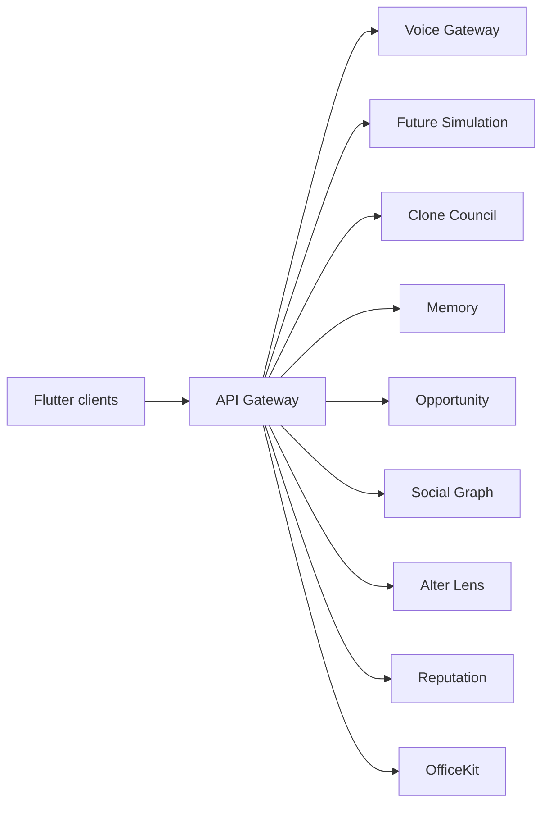

# ALTER API Gateway

API Gateway is the client-facing edge service for health aggregation, route
discovery, and Mission Control summaries.

```mermaid
flowchart LR
  C["Flutter clients"] --> G["API Gateway"]
  G --> V["Voice Gateway"]
  G --> F["Future Simulation"]
  G --> CC["Clone Council"]
  G --> M["Memory"]
  G --> O["Opportunity"]
  G --> S["Social Graph"]
  G --> L["Alter Lens"]
  G --> R["Reputation"]
  G --> OK["OfficeKit"]
```
