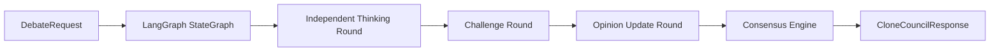

# ALTER Clone Council

Production-oriented LangGraph service for ALTER's Clone Council.

## Flow

1. User asks a question.
2. Seven clone agents think independently.
3. Each agent challenges other agents.
4. Each agent updates its opinion.
5. Consensus Engine returns the debate transcript, final recommendation, confidence score, risks, and opportunities.

## Agents

- Current You
- Future You
- Founder You
- Investor You
- Mentor You
- Recruiter You
- Realist You

## Run

```bash
cd services/clone_council
python -m venv .venv
.venv\Scripts\activate
pip install -e ".[dev]"
copy .env.example .env
uvicorn alter_clone_council.api:app --reload --port 8080
```

Set `OPENAI_API_KEY` before calling the production model client.

## API

```bash
curl -X POST http://localhost:8080/v1/clone-council/debate ^
  -H "Content-Type: application/json" ^
  -d "{\"question\":\"Should I raise a seed round now or bootstrap for six more months?\"}"
```

## Architecture


