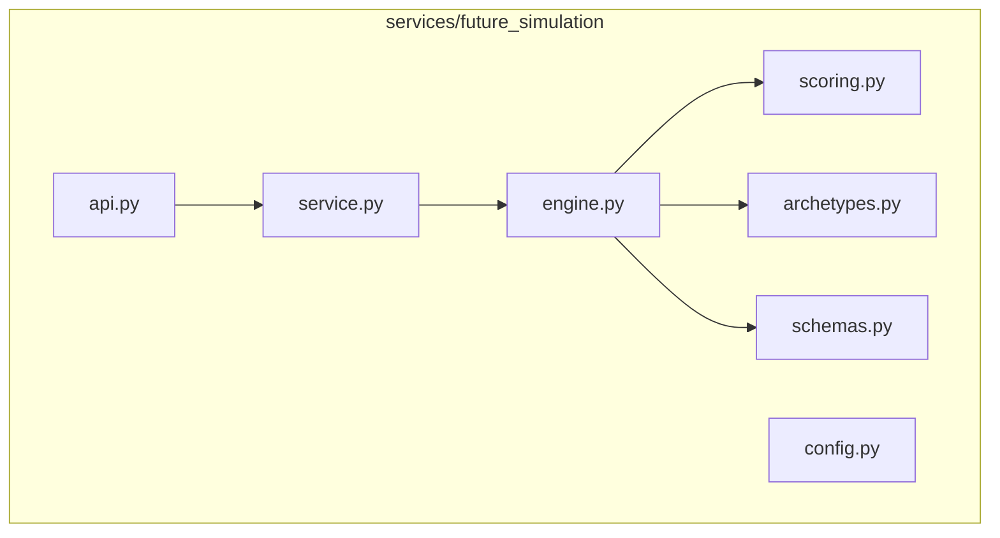

# ALTER Future Simulation Engine

Backend service that projects three plausible futures for a user from profile, skills, goals, experience, and interests.

## Outputs

For each future:

- Timeline
- Salary trajectory
- Skill trajectory
- Network growth
- Opportunity score
- Risk score
- Success probability

## Backend Architecture

```mermaid
flowchart LR
  Client["Mobile / API Gateway"] --> API["FastAPI API"]
  API --> Validator["Pydantic Input Validation"]
  Validator --> Engine["Simulation Engine"]
  Engine --> Signals["Signal Extraction"]
  Signals --> Archetypes["Future Archetype Generator"]
  Archetypes --> Scoring["Opportunity / Risk / Probability Scoring"]
  Scoring --> Projection["Trajectory Builder"]
  Projection --> Response["Structured JSON Response"]
```



## Service Boundaries



## Run

```bash
cd services/future_simulation
python -m venv .venv
.venv\Scripts\activate
pip install -e ".[dev]"
uvicorn alter_future_simulation.api:app --reload --port 8090
```

## Example

```bash
curl -X POST http://localhost:8090/v1/future-simulation/simulate ^
  -H "Content-Type: application/json" ^
  -d @examples/request.json
```

