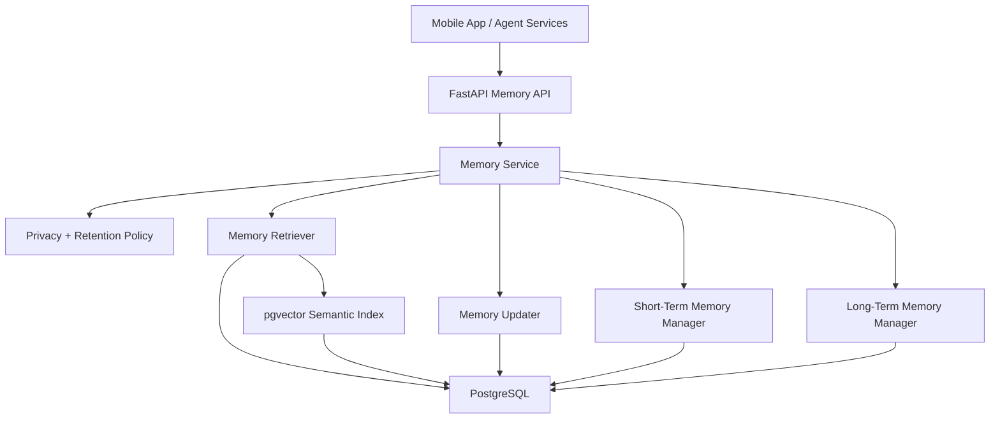
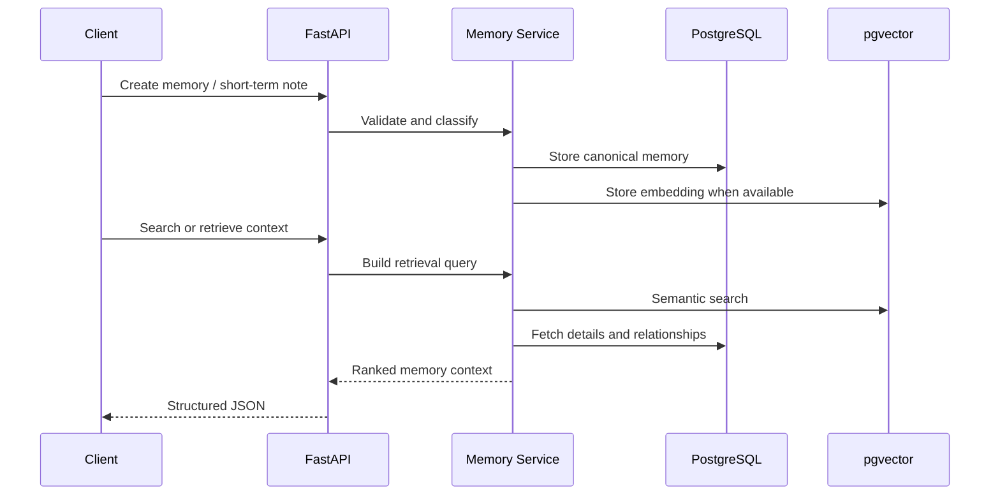
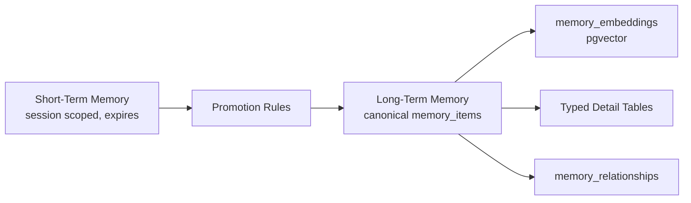

# ALTER Memory System

Local-first, governed lifelong memory for skills, projects, goals, conversations,
opportunities, decisions, relationships, and learning progress.

The system defaults to forgetting. A deterministic classifier rejects restricted
secrets, routes temporary context into TTL-backed short-term memory, and requires
confirmation before durable or sensitive signals become identity evidence.

## High-Level Architecture



## Data Flow



## Storage Strategy



Short-term memory stores volatile session facts and working context with TTL. Long-term memory stores durable facts, decisions, relationships, and user history. Promotion links a short-term item to a durable `memory_items` row.

## APIs

| Method | Path | Purpose |
| --- | --- | --- |
| `POST` | `/v1/memory/items` | Create long-term memory |
| `POST` | `/v1/memory/ingest` | Classify and safely ingest an interaction |
| `GET` | `/v1/memory/items/{memory_id}` | Fetch memory |
| `PATCH` | `/v1/memory/items/{memory_id}` | Update memory |
| `POST` | `/v1/memory/items/{memory_id}/archive` | Archive memory |
| `POST` | `/v1/memory/search` | Semantic or lexical memory search |
| `POST` | `/v1/memory/retrieve` | Retrieve agent-ready memory context |
| `POST` | `/v1/memory/short-term` | Create short-term memory |
| `POST` | `/v1/memory/short-term/promote` | Promote short-term memory to long-term |
| `GET` | `/v1/memory/users/{user_id}/timeline` | Recent durable memories |
| `GET` | `/v1/memory/architecture` | Service architecture summary |
| `GET` | `/v1/memory/users/{user_id}/governance` | Inspect retention and control policy |
| `GET` | `/v1/memory/users/{user_id}/identity` | Build an evidence-based identity snapshot |
| `GET` | `/v1/memory/users/{user_id}/export` | Export shareable portable memory |

## Memory Lifecycle

```text
encode -> stabilize -> store -> retrieve -> update -> forget
```

- Restricted secrets are immediately rejected.
- Low-information interactions are ephemeral.
- Session and expiring memories use short-term storage with TTL.
- Durable and sensitive memories require explicit confirmation by default.
- Retrieval builds a ranked context package with a strict character budget.
- Identity snapshots contain evidence links and never infer from one interaction.

## Run

```bash
cd services/memory_system
python -m venv .venv
.venv\Scripts\activate
pip install -e ".[dev]"
uvicorn alter_memory_system.api:app --reload --port 8100
```

Apply migrations to PostgreSQL:

```bash
psql "$ALTER_DATABASE_URL" -f migrations/001_extensions.sql
psql "$ALTER_DATABASE_URL" -f migrations/002_memory_schema.sql
```

