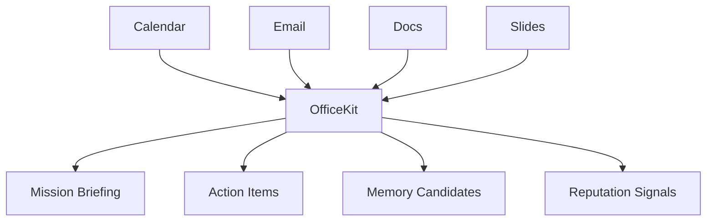

# ALTER OfficeKit

OfficeKit converts calendar, email, document, and slide artifacts into mission
briefings, action items, memory candidates, and reputation signals.

```mermaid
flowchart TD
  A["Calendar"] --> O["OfficeKit"]
  B["Email"] --> O
  C["Docs"] --> O
  D["Slides"] --> O
  O --> E["Mission Briefing"]
  O --> F["Action Items"]
  O --> G["Memory Candidates"]
  O --> H["Reputation Signals"]
```
