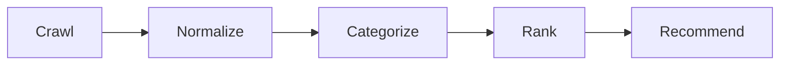
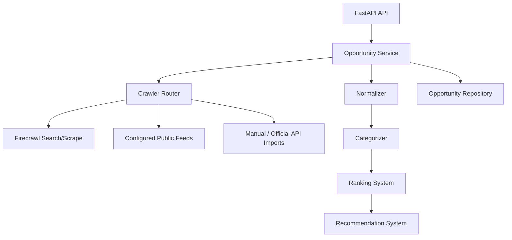

# ALTER Opportunity Engine

Opportunity discovery service for internships, fellowships, hackathons, accelerators, research programs, startup grants, and other high-signal opportunities.

## Sources

- LinkedIn
- Internshala
- Unstop
- Devpost
- YC
- GSoC
- Google programs
- Research fellowships
- Startup grants

LinkedIn and other restricted sources are implemented through compliant adapters: official APIs, user-provided exports, configured public feeds, or Firecrawl on allowed public URLs. The service does not bypass authentication, paywalls, robots rules, or anti-bot controls.

## Pipeline



## Backend Architecture



## APIs

| Method | Path | Purpose |
| --- | --- | --- |
| `GET` | `/healthz` | Health check |
| `GET` | `/v1/opportunities/sources` | Source registry and compliance modes |
| `POST` | `/v1/opportunities/crawl` | Crawl raw opportunities |
| `POST` | `/v1/opportunities/normalize` | Normalize raw opportunities |
| `POST` | `/v1/opportunities/categorize` | Categorize normalized opportunities |
| `POST` | `/v1/opportunities/rank` | Score ranked opportunities |
| `POST` | `/v1/opportunities/recommend` | Recommend opportunities for a user |
| `POST` | `/v1/opportunities/pipeline` | Run crawl -> normalize -> categorize -> rank -> recommend |

## Run

```bash
cd services/opportunity_engine
python -m venv .venv
.venv\Scripts\activate
pip install -e ".[dev]"
uvicorn alter_opportunity_engine.api:app --reload --port 8110
```

## Firecrawl

Set `ALTER_FIRECRAWL_API_KEY` to enable web discovery. The implementation uses Firecrawl `/search` and `/scrape` style retrieval for public, allowed sources and falls back to deterministic source seeds in local/test mode.

