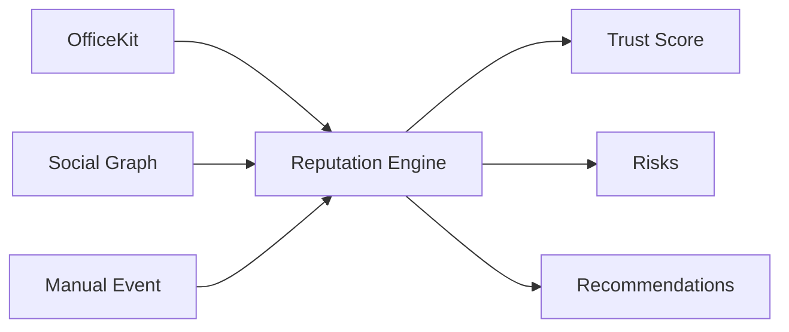

# ALTER Reputation Engine

Reputation Engine tracks follow-through, intros, missed replies, contribution,
and trust signals. It turns events into a score and actionable recommendations.

```mermaid
flowchart LR
  A["OfficeKit"] --> R["Reputation Engine"]
  B["Social Graph"] --> R
  C["Manual Event"] --> R
  R --> D["Trust Score"]
  R --> E["Risks"]
  R --> F["Recommendations"]
```
