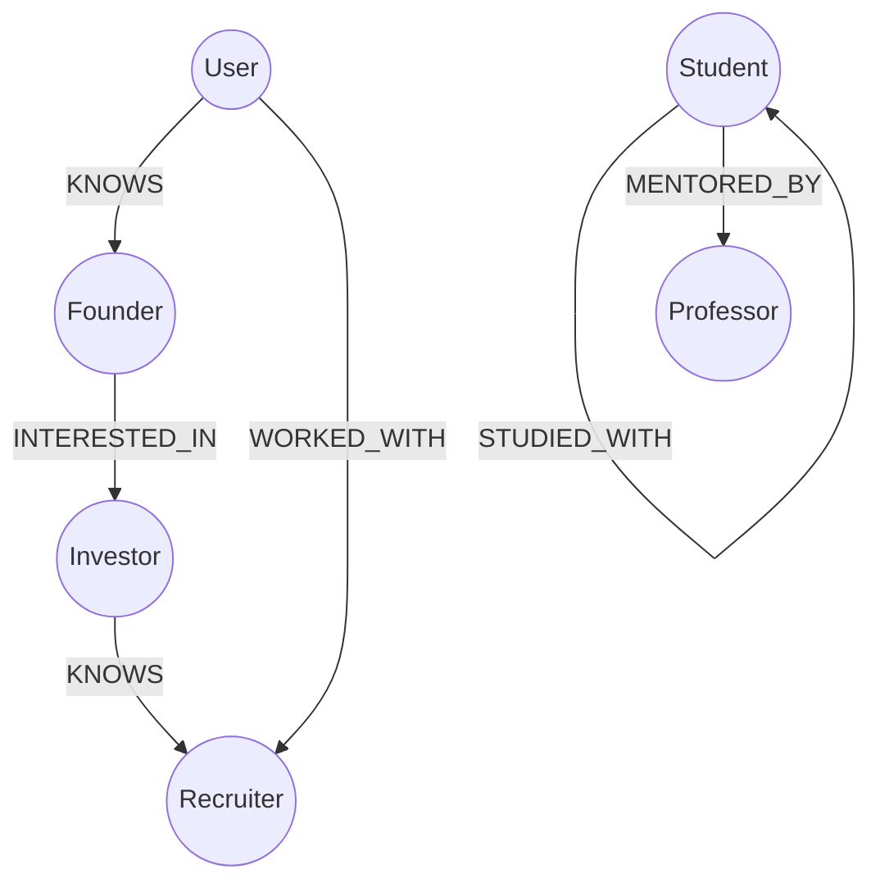
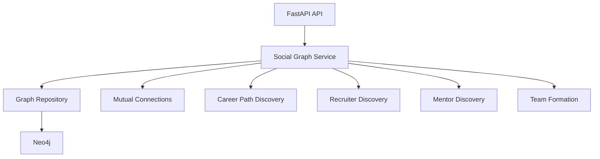

# ALTER Social Graph Engine

Neo4j-backed social graph service for relationship intelligence, mutual connections, career paths, recruiter discovery, mentor discovery, and team formation.

## Graph Model



## Feature Architecture



## APIs

| Method | Path | Purpose |
| --- | --- | --- |
| `POST` | `/v1/social-graph/people` | Upsert User, Founder, Recruiter, Professor, Student, or Investor |
| `GET` | `/v1/social-graph/people/{person_id}` | Fetch person |
| `POST` | `/v1/social-graph/relationships` | Create graph relationship |
| `POST` | `/v1/social-graph/mutual-connections` | Find mutual connections |
| `POST` | `/v1/social-graph/career-paths` | Discover paths to a career role |
| `POST` | `/v1/social-graph/discover/recruiters` | Discover recruiters |
| `POST` | `/v1/social-graph/discover/mentors` | Discover mentors |
| `POST` | `/v1/social-graph/team-formation` | Recommend team members |

## Run

```bash
cd services/social_graph
python -m venv .venv
.venv\Scripts\activate
pip install -e ".[dev]"
uvicorn alter_social_graph.api:app --reload --port 8120
```

Apply schema:

```bash
cypher-shell -u "$ALTER_NEO4J_USER" -p "$ALTER_NEO4J_PASSWORD" -f schema/001_social_graph.cypher
```

