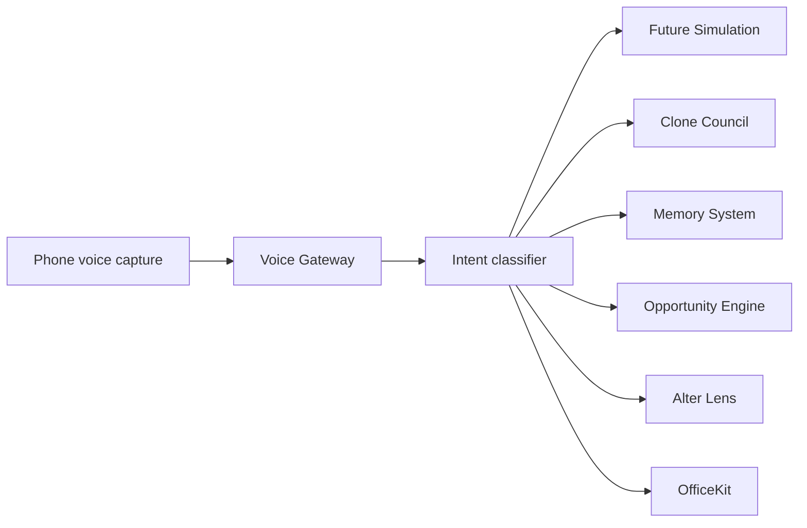

# ALTER Voice Gateway

Voice Gateway is the phone-first command intake layer. It receives a transcript
from wake word or push-to-talk capture, detects intent, and returns routing
targets for the rest of ALTER.



Run:

```powershell
cd services\voice_gateway
python -m venv .venv
.\.venv\Scripts\python.exe -m pip install -e ".[dev]"
.\.venv\Scripts\python.exe -m uvicorn alter_voice_gateway.api:app --port 8070
```
